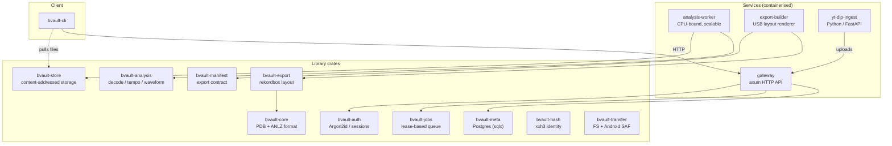
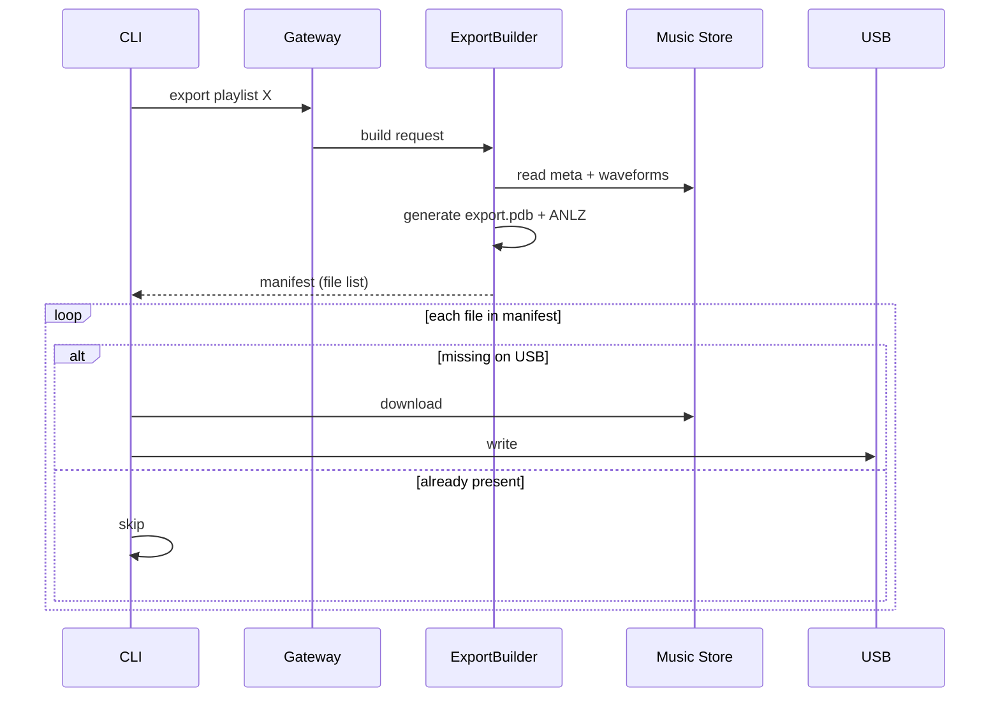

# bvault-app

The application at the heart of BeatVault: a Rust workspace that ingests audio from anywhere,
analyses it, and writes **Pioneer CDJ-ready USB drives** — no rekordbox, no proprietary
desktop software. Manage your library from the terminal, on desktop or on Android, and export
a playlist to any club's CDJ.

The part that makes this possible is a from-scratch, byte-level implementation of Pioneer's
export format. BeatVault writes the `export.pdb` device database and the `ANLZ` analysis
files (beat grids, waveforms, cue points) that a CDJ expects to find, built up from
[Deep Symmetry's reverse-engineering research](https://djl-analysis.deepsymmetry.org/rekordbox-export-analysis/).

---

## What it does

- **Ingest** from YouTube (single tracks, playlists, or authenticated via SSO), local files
  and folders, or Google Drive.
- **Analyse** every track: BPM, a constant-tempo beat grid, and the multiple waveform
  granularities a CDJ renders — all in pure Rust, no system FFmpeg for decoding.
- **Organise** into playlists, all scoped per-user with real data-layer multi-tenancy.
- **Export** a playlist to a USB drive that plugs straight into a CDJ, or to a local folder.
- **Run anywhere** the binary compiles — including Termux on Android, thanks to a storage
  abstraction over Android's Storage Access Framework.

---

## Architecture

The workspace is split into small, single-purpose library crates and the deployable services
that compose them. The split keeps compile times down, prevents circular dependencies, and
lets the CLI link only the light crates it needs without pulling in the heavy `.pdb` builder.



### Crates

| Crate | Responsibility |
|-------|----------------|
| `bvault-core` | Bit-exact PDB (little-endian) and ANLZ (big-endian) serialization with `binrw` |
| `bvault-analysis` | Audio decode (`symphonia`), BPM/beat detection, FFT waveforms (`rustfft`) |
| `bvault-export` | Turns tracks + playlists into a rekordbox USB folder layout and manifest |
| `bvault-store` | Content-addressed raw + artifact stores with marker-atomic writes |
| `bvault-meta` | Relational layer over Postgres, compile-time-checked queries via `sqlx` |
| `bvault-jobs` | Postgres-backed job queue with lease-based claim and heartbeats |
| `bvault-auth` | Argon2id hashing, SHA-256-hashed session tokens, AES-256-GCM cookies |
| `bvault-hash` | 64-bit `xxh3` content identity, streaming (`io::Write`) so files aren't buffered |
| `bvault-manifest` | Pure `serde` data contract describing a USB export |
| `bvault-transfer` | Unified writer over standard filesystems and Android SAF |
| `bvault-cli` | The `bvault` command-line client |

### Services

| Service | Role |
|---------|------|
| `gateway` | The public HTTP API (`axum`/`tokio`). Owns the DB schema, runs migrations on startup, enqueues jobs. |
| `analysis-worker` | Pulls analysis jobs and runs decode + waveform generation. Stateless and horizontally scalable — several pods claim work concurrently under Postgres row locks. |
| `export-builder` | Builds the `.pdb` + `ANLZ` layout in a staging area and returns a manifest to the client. |
| `yt-dlp-ingest` | A Python/FastAPI worker wrapping `yt-dlp` directly, for maximum extractor compatibility. |

Full technical write-ups live in
[`docs/technical_crates.md`](../docs/technical_crates.md) and
[`docs/technical_services.md`](../docs/technical_services.md).

---

## The export model

Most tools generate an entire USB image server-side and make you download a huge archive.
BeatVault treats the USB as a sync target instead. The `export-builder` returns a *manifest*
of the desired layout, and the client only pulls the files that aren't already on the stick.



Add five tracks to a thousand-track playlist and only those five are transferred.

---

## Security

- Passwords hashed with **Argon2id** and a random per-password salt.
- Session tokens are 256-bit CSPRNG values; only their **SHA-256 hash** is stored, so a
  database leak can't be replayed into live sessions.
- Cookies encrypted with **AES-256-GCM**.
- **Multi-tenancy is enforced in the data layer** — every query is scoped by `user_id`, not
  filtered in application code after the fact.

---

## Using the CLI

Build it:

```bash
cargo build --release -p bvault-cli
# binary at target/release/bvault
```

A quick tour:

```console
$ bvault login
  Username: dj_pepe
  Password: ******
  ✓ Welcome back, dj_pepe!

$ bvault ingest youtube "windowlicker"
  ✓ Aphex Twin - WindowLicker chosen
  ⠋ downloading & analyzing... ✓
  ✓ ingested successfully

$ bvault library
  ┌────────────────┬───────┬─────┬────────┐
  │ Track          │ BPM   │ Key │ Length │
  ├────────────────┼───────┼─────┼────────┤
  │ Windowlicker   │ 128.0 │ Am  │ 6:23   │
  │ Xtal           │ 100.5 │ Dm  │ 4:51   │
  └────────────────┴───────┴─────┴────────┘

$ bvault playlist add warmup "windowlicker, xtal"
  ✓ Playlist 'warmup' successfully updated.

$ bvault export warmup --usb
  ✓ KINGSTON 32 GB chosen
  ⠋ building rekordbox layout (PDB + ANLZ)... ✓
  ✓ rekordbox USB written — plug into any CDJ
```

### Command reference

**Authentication** — `login`, `logout`, `register`.

**Ingestion** — newly ingested tracks are queued for background analysis automatically;
`--bg` returns immediately without waiting.
- `bvault ingest <query> --youtube` — a single YouTube URL or search.
- `bvault ingest <url> --youtube-playlist` — an entire playlist.
- `bvault ingest --youtube-sso` — interactive single sign-on for authenticated downloads.
- `bvault ingest <path> --local [--playlists]` — files or a folder; `--playlists` creates
  playlists from top-level subfolders.
- `bvault ingest <folder_id> --gdrive` — import from a Google Drive folder.

**Library** — `bvault library [--search <title>]`.

**Playlists** — `list`, `view <name>`, `add <name> [tracks]`, `remove <name> <tracks>`,
`delete <name>`.

**Export**
- `bvault export <playlist> --usb` — auto-detect the USB and write the rekordbox layout.
- `bvault export <playlist> --path <dir>` — export to a local directory instead.

**Download** — `bvault download "<playlist>" --playlist --out <dir>`, or a comma-separated
fuzzy list of track names.

**Jobs** — `bvault status [ingest|analysis]` to watch background queues.

> The `export` command currently handles one playlist at a time; re-exporting overwrites the
> USB's `export.pdb`.

---

## Android

The CLI cross-compiles to `aarch64-linux-android` and runs under Termux:

```bash
./build_android.ps1   # cargo cross build --target aarch64-linux-android --release -p bvault-cli
```

A small companion app, **BeatVault Connect** (`bvault-android-connect/`), handles the one
thing a headless CLI can't do well on a phone: it opens a Google sign-in in a WebView and
syncs the resulting YouTube cookies to the gateway, so authenticated ingestion works from
mobile.

---

## Build & CI

Each service has its own image build workflow that triggers only when its code (or a crate it
depends on) changes, via path filters. A reusable `build-image.yaml` job authenticates to AWS
through **GitHub OIDC** (the `lab-builder` role — no static keys), builds with a
`cargo-chef` layered Dockerfile so dependency compilation is cached per service across runs,
and pushes to ECR under an **immutable, git-SHA tag**. Deploying that image is a separate
step: bump the tag in [bvault-manifests](https://github.com/xilver1/bvault-manifests) and
ArgoCD rolls it out.

```
services/
├── gateway/            # axum API, schema owner
├── analysis-worker/    # scalable analysis consumer
├── export-builder/     # rekordbox layout renderer
└── yt-dlp-ingest/      # Python ingest worker
crates/                 # eleven library crates (see table above)
```